# market-data-analysis
Implementation of data analysis methods on market data originally for my Econophysics course by Dr. Rahimi Tabar.

In detail explanations and result analysis of the following methods can be found in the notebook file corresponding to said method. All code is written in Julia and no predictive machine learning methods are used due to the volatile nature of financial markets and non-gaussian distribution of return rates shown in the first notebook.

## 1-Return Rate Distribution and Fat-Tail Exponent Calculation
The return rate distribution of financial markets are almost always fat-tailed and their tails can be fitted with an exponential function and an exponent can be calculated. The following is for 1-min gold data.
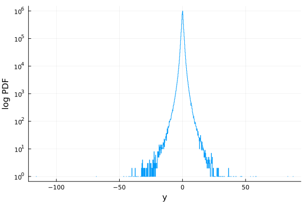

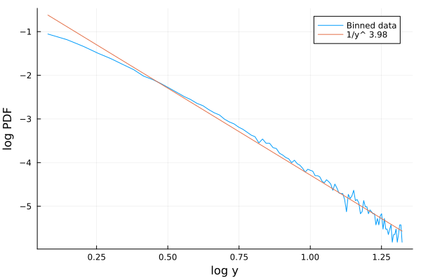

## 2-Ordinal Pattern Analysis on Market Data
[Ordinal patterns](https://www.researchgate.net/figure/Ordinal-patterns-of-length-W-4-and-corresponding-permutation-indices_fig1_265272228) are useful tools for analysing time-series behaviour and here, we use them to find correlations between the subsequent patterns within the market price time-series with lag = 1. (Detailed explanation in notebook)

### Gold Data
Ordinal patterns distribution and transfer probability matrix for 1-min gold data. We can also use moving average windows to reduce noise on our data. The window size is calculated using a Kramers–Moyal expansion approach resulting in an optimal window size of 10 minutes.

Without moving average:

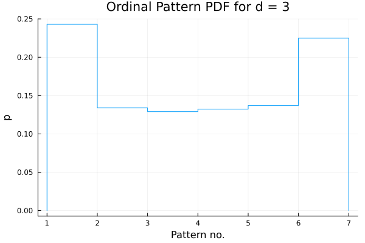

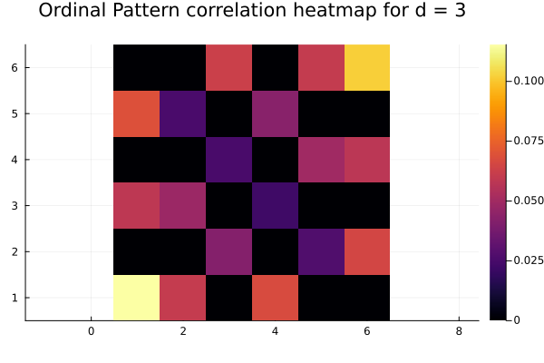

Because of the fast methods used for the ordinal patterns, we can use higher length permutations too.

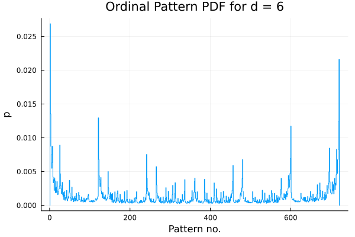

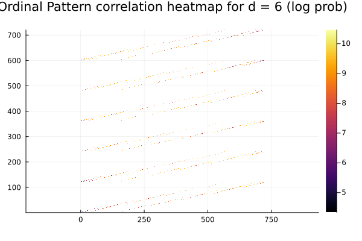

With moving average:

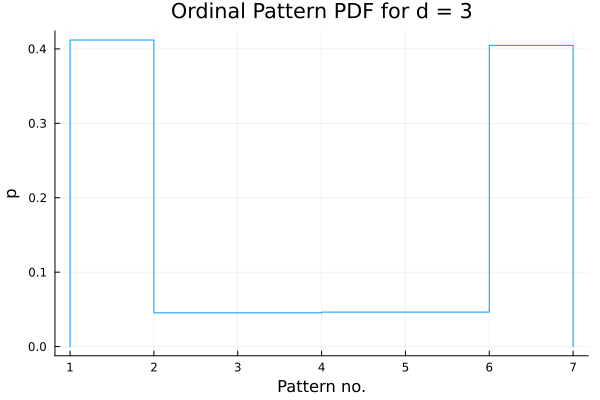

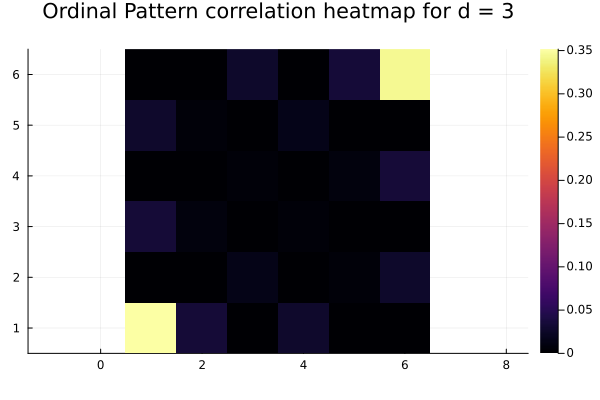

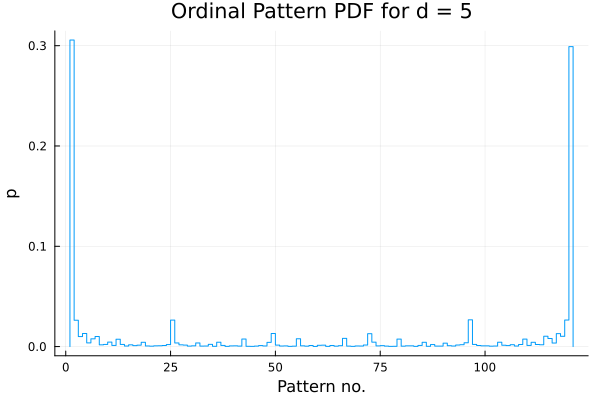

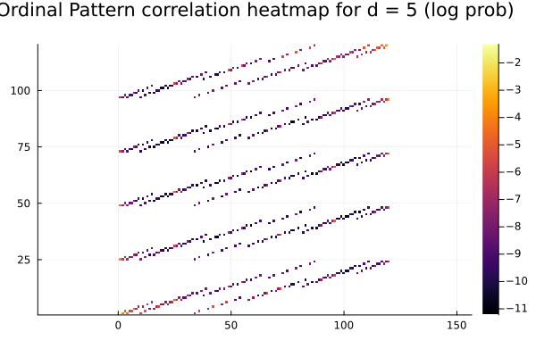

### Biased generate Data
Since markets are fairly random, this type of analysis shows a rather uniform distribution within the ordinal patterns. We can see the power of this method by testing it on biased data. (No normalization or averaging is done)

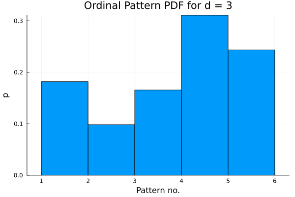

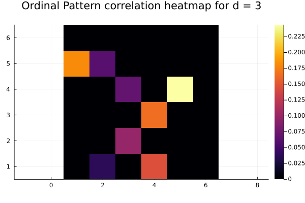

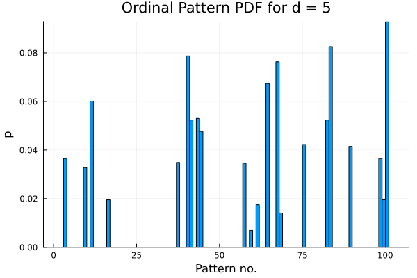

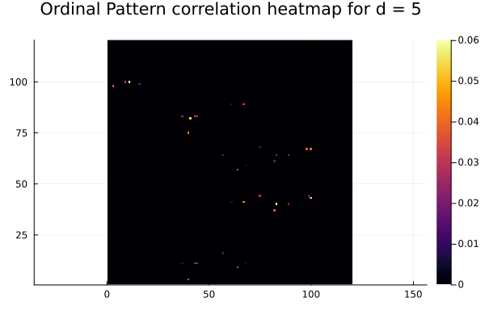
